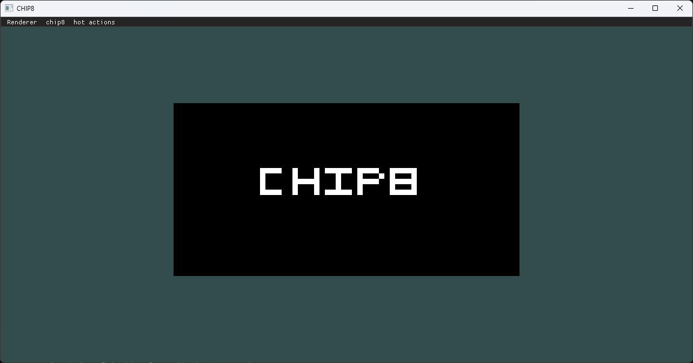
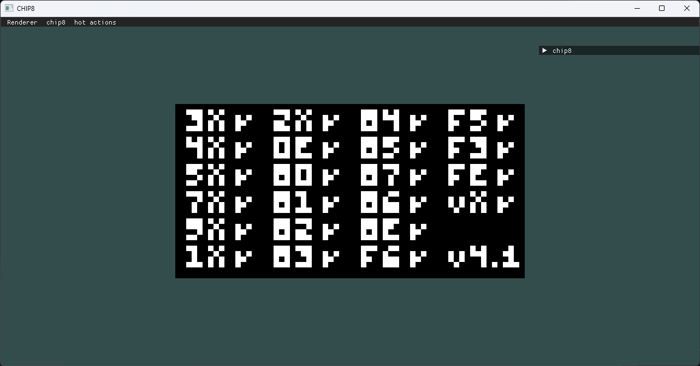
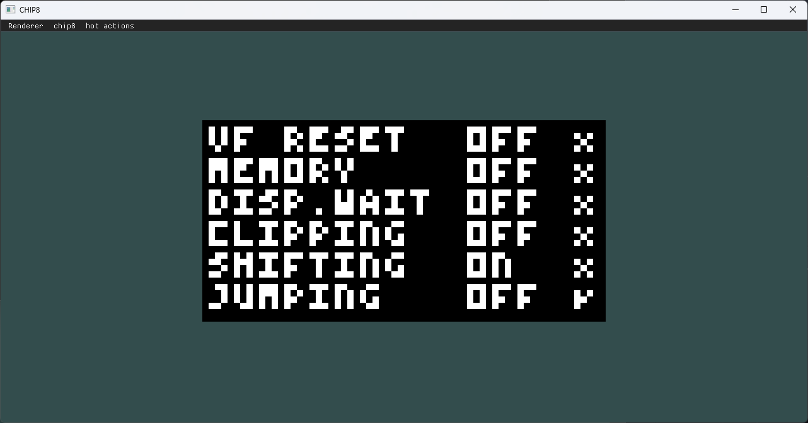

<h1 align="center"> CHIP8 emulator </h1>

CHIP-8 is an interpreted programming language, developed by Joseph Weisbecker on his 1802 microprocessor. It was initially used on the COSMAC VIP and Telmac 1800, which were 8-bit microcomputers made in the mid-1970s. [[wiki](https://en.wikipedia.org/wiki/CHIP-8)]

## cmake variables 
| Name           | Description              | Default value  |
|----------------|--------------------------|----------------|
|CHIP8_BUILD_APP | build desktop application| OFF            |

## Desktop application
dekstop application written using glad for loading opengl, glfw for window creation and imgui for ui.

### thirdparty libraries

- tinyfd
- [glfw](https://www.glfw.org/)
- [glad](https://github.com/Dav1dde/glad)
- [imgui](https://github.com/ocornut/imgui/tree/master)

### screenshots

#### Tests

all test ROM`s downloaded from [github](https://github.com/Timendus/chip8-test-suite)

#### Corax+ opcode test

### Quirks test
